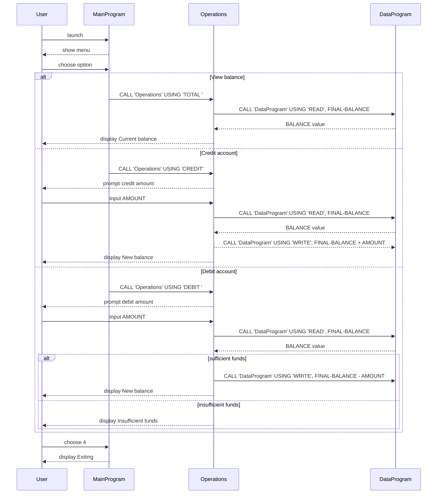

# COBOL Student Account Management (week4-lab4)

This document explains the purpose of each COBOL source file in the repository, key routines and business rules in the student account management program.

## Project overview

- Simple console-based account management app.
- Supports view balance, credit account, debit account.
- Maintains one shared balance (in-memory) and reuses it by calling `DataProgram`.
- Intended for lab practice with COBOL program division, calls, and data sharing.

## Files and responsibilities

### `src/cobol/main.cob`
- Program ID: `MainProgram`
- User interface and menu loop (`MAIN-LOGIC`).
- Uses `PERFORM UNTIL CONTINUE-FLAG = 'NO'` to keep app running.
- Accepts option 1..4 from user:
  - 1: Call `Operations` with `TOTAL ` to show current balance.
  - 2: Call `Operations` with `CREDIT` to add funds.
  - 3: Call `Operations` with `DEBIT ` to withdraw funds.
  - 4: Exit program.
- Invalid options show error message.

### `src/cobol/operations.cob`
- Program ID: `Operations`
- Implements the business actions: balance query, credit, debit.
- Uses `CALL 'DataProgram'` to read/write persistent balance state.
- Key paragraphs:
  - `TOTAL`: read and display current balance.
  - `CREDIT`: prompt amount, read balance, add amount, write back, display new balance.
  - `DEBIT`: prompt amount, read balance, check sufficient funds, subtract amount, write back, or show "Insufficient funds".
- Current amount and balance fields use `PIC 9(6)V99` (up to 999999.99).

### `src/cobol/data.cob`
- Program ID: `DataProgram`
- Manages in-memory storage variable `STORAGE-BALANCE`.
- API via linkage parameters: `PASSED-OPERATION` and `BALANCE`.
- `READ` operation: copy `STORAGE-BALANCE` to output `BALANCE`.
- `WRITE` operation: update `STORAGE-BALANCE` from input `BALANCE`.
- Location of persistent effective balance value across calls.

## Student account business rules

- Starting balance is `1000.00` (in `DataProgram`).
- Credit operations always apply full amount and update balance.
- Debit operations require `FINAL-BALANCE >= AMOUNT` (no overdraft).
- If insufficient funds, debit is rejected and balance remains unchanged.
- Balance value is always read before update, then written back.

## Notes and behavior

- Minimal validation of user input in `main.cob` and `operations.cob`.
- If non-numeric input is entered at `ACCEPT AMOUNT`, the behavior depends on the COBOL runtime and is not explicitly guarded.
- In `Operations`, operation strings are fixed-length 6-chars (`'TOTAL '`, `'DEBIT '`).

## Running (CLI interaction)

1. Compile or run with COBOL toolchain (e.g., `cobc -x -free src/cobol/main.cob src/cobol/operations.cob src/cobol/data.cob`).
2. Start executable.
3. Use menu to query/credit/debit.
4. Option 4 exits.

## Sequence diagram (Mermaid)

